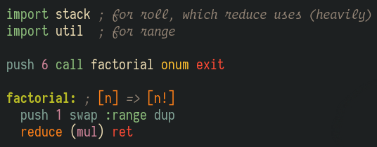

 
"Code should be invisible." — someone, surely

# Spitewaste

**Spitewaste** is a collection of tools with the noble goal of making your code disappear. Far too many CPU cycles are spent on displaying visible source code, and much too much ink has been spilled in the service of program printouts. We need a language whose only syntactic elements are space, tab, and newline; we need [Whitespace](https://en.wikipedia.org/wiki/Whitespace_(programming_language)).

Of course, writing programs in *pure* Whitespace is a task beyond mere mortals, but it'd be great if we could at least transpile to that most ephemerally beautiful of languages. To that end, I've endeavored to make spiting the aforementioned wastefulness (get it?<b id="a1">[*](#f1)</b>) a little more tractable by laying a thin veneer of syntax and additional semantics over the Whitespace instruction set.

~~Many~~ [Some](https://rosettacode.org/wiki/Category:Whitespace) programs have been written in "Whitespace assembly", but this is *Spitewaste* assembly: 

Granted, that gets translated to [all this](demo/factorial.wsa) (which is just a nicer way of saying [this](demo/factorial.asm), though not nearly as nice as [*this*](demo/factorial-nicespace.png)), but that's the price paid for convenience. Besides, we're much less interested in the size of the code than we are in how many printable characters it ultimately contains, and the best possible score on that metric is zero.

<b id="f1">*</b> Kidding, of course; it's so named because I wrote it in **spite** of it being a huge **waste** of... all the things. [↩](#a1)

## What is it?

Spitewaste is the pseudo-assembly language referred to throughout this document, as well as its accompanying standard library of useful subroutines ([`libspw`](lib/spitewaste/libspw)). The assembler that converts programs written in this language to pure Whitespace is also called Spitewaste, but the executable (and conventional extension) is `spw`.

**spw** is a command-line utility whose primary purpose is to "lower" Spitewaste programs to Whitespace for execution by some external interpreter, but it's capable of several (perhaps too many) other transformations; see `spw help convert` for further details. In addition to losslessly converting between various representations, spw can generate pretty pictures of Whitespace code syntax-highlighted in your favorite color scheme via `spw image`.

Spitewaste is not [a Whitespace interpreter](collidedscope/spiceweight), but `spw exec` will convert its input to something your interpreter of choice should understand and ferry it along. Finally, `spw compile` will blindly translate Whitespace instructions to functionally equivalent C++ code and feed that into a compiler; the results aren't spectacular (compilers loathe `goto`), but it's fun to pretend Whitespace is a compiled language.

## Where can I get it?

The project is distributed as a Ruby gem, so you're just a `gem install spitewaste` away from being able to run Spitewaste programs and/or turn them into executable nothingness. The package includes the assembler (a Ruby module), the CLI that drives it (**`spw`**), as well as the standard library (`libspw`).

## How do I use it?

See `spw help` for guidance on invoking the command-line interface, and [this tutorial](TUTORIAL.md) for information regarding what Spitewaste offers over plain-old Whitespace assembly.

## When will it do X?

- [x] Convert from
* Spitewaste to: Whitespace (ws), Whitespace assembly (wsa; just preprocessed spw), straight-line opcodes (asm)
* {ws, wsa, asm} to {ws, wsa, asm}
* all supported formats to C++ and PNG
- [x] Execute all supported formats by converting to Whitespace and passing the results to a user-specified interpreter
- [ ] Thoroughly document the standard library and make it searchable (eventually `spw docs`)
- - [ ] using a doctest-like approach for free specs
- [ ] Write a proper Spitewaste parser for better error reporting (and performance?)
- [ ] Support user-specified aliases of the builtin mnemonics in case you wanna say `discard` instead of `pop`, etc.
- [ ] Resolve missing identifiers by auto-importing the necessary standard library?
- [ ] Run a program with several interpreters to compare output and performance?
- [ ] Show inline opcodes with `spw image`?

## Why is this a thing?

Because it's fun, of course! Any useful knowledge gained along the way is just icing on the cake.

## Who wants to help?

The standard library currently sports just over a hundred "functions". A lot of them are pretty neat, but there's certainly room for many more. If you're up to it, I encourage you to learn just enough Spitewaste to be dangerous and contribute anything you feel is missing.
